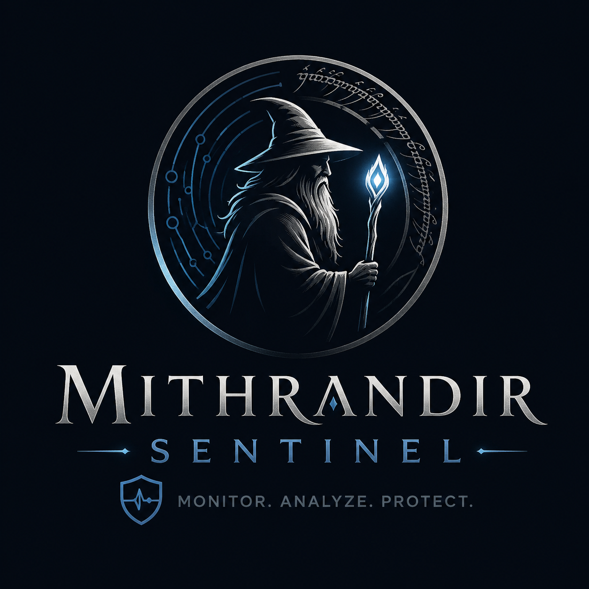
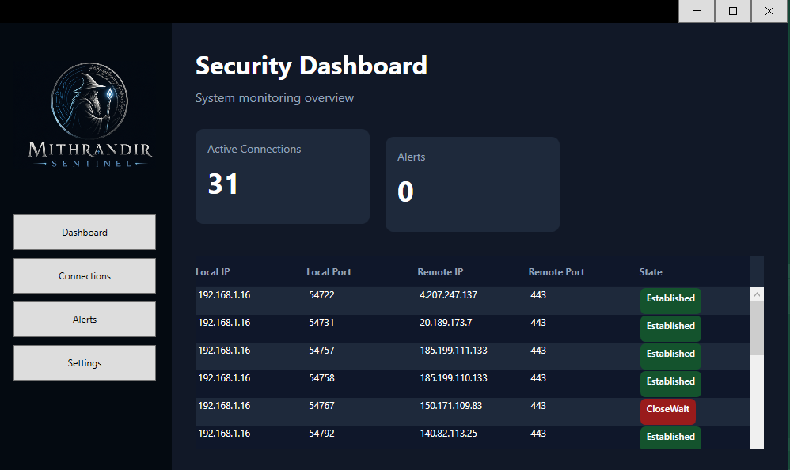

## 🌍 Languages

- 🇺🇸 English
- 🇪🇸 Español

---

<details open>
<summary><strong>🇺🇸 English</strong></summary>

---

# Mithrandir Sentinel

Mithrandir Sentinel is a modern desktop cybersecurity monitoring application built with WPF and C#.

The project focuses on defensive security concepts, real-time TCP connection monitoring, and clean desktop architecture using the MVVM pattern.

---

## Features

- Real-time TCP connection monitoring
- Dynamic dashboard interface
- MVVM architecture
- Modern WPF UI using MahApps.Metro
- Live updating DataGrid
- Connection state visualization
- Basic threat detection system (in progress)

---

## Tech Stack

- C#
- .NET 10
- WPF
- MVVM
- MahApps.Metro
- CommunityToolkit.Mvvm

---

## Architecture

The project follows a clean MVVM-based architecture:

```text
Views
↓
ViewModels
↓
Services
↓
Models
```

### Current Services

- `NetworkService`
  - Retrieves active TCP connections from the system

- `ThreatDetectionService`
  - Analyzes suspicious connections and generates alerts

---

## Current Dashboard

The application currently supports:

- Active TCP connection monitoring
- Real-time UI updates
- Dynamic connection table
- Connection state indicators
- Dark modern UI

---

## Planned Features

- Process detection
- IP geolocation
- Suspicious IP detection
- Port scan detection
- Threat severity system
- Export logs
- Notifications
- Historical monitoring
- Connection filtering
- SIEM-style dashboard improvements

---

## Learning Goals

This project is also part of my learning journey in:

- Cybersecurity fundamentals
- Defensive security
- Desktop application architecture
- WPF and MVVM
- System and network monitoring
- Real-time UI design

---

## Screenshots



---

## Disclaimer

This project is intended for educational and defensive security purposes only.

</details>

---

<details>
<summary><strong>🇪🇸 Español (Haz clic para abrir el desplegable)</strong></summary>

## Mithrandir Sentinel

Mithrandir Sentinel es una aplicación moderna de monitoreo de ciberseguridad para escritorio, desarrollada con WPF y C#.

El proyecto se enfoca en conceptos de seguridad defensiva, monitoreo de conexiones TCP en tiempo real y una arquitectura de escritorio limpia utilizando el patrón MVVM.

## Características
- Monitoreo de conexiones TCP en tiempo real
- Interfaz de panel dinámico
- Arquitectura MVVM
- Interfaz moderna en WPF utilizando MahApps.Metro
- DataGrid con actualización en vivo
- Visualización del estado de las conexiones
- Sistema básico de detección de amenazas (en desarrollo)

## Tech Stack

- C#
- .NET 10
- WPF
- MVVM
- MahApps.Metro
- CommunityToolkit.Mvvm

## Arquitectura

El proyecto sigue una arquitectura limpia basada en MVVM.

```text
Views
↓
ViewModels
↓
Services
↓
Models
```

## Estado actual del panel

Actualmente, la aplicación soporta:

- Monitoreo de conexiones TCP activas
- Actualizaciones de interfaz en tiempo real
- Tabla dinámica de conexiones
- Indicadores del estado de las conexiones
- Interfaz moderna en modo oscuro

## Funcionalidades planificadas
- Detección de procesos
- Geolocalización de IP
- Detección de IP sospechosas
- Detección de escaneo de puertos
- Sistema de severidad de amenazas
- Exportación de registros
- Notificaciones
- Monitoreo histórico
- Filtrado de conexiones
- Mejoras estilo dashboard SIEM

## Objetivos de aprendizaje

Este proyecto también forma parte de mi proceso de aprendizaje en:

- Fundamentos de ciberseguridad
- Seguridad defensiva
- Arquitectura de aplicaciones de escritorio
- WPF y MVVM
- Monitoreo de sistemas y redes
- Diseño de interfaces en tiempo real

## Screenshots


## Aviso

Este proyecto está destinado únicamente a fines educativos y de seguridad defensiva.

</details>