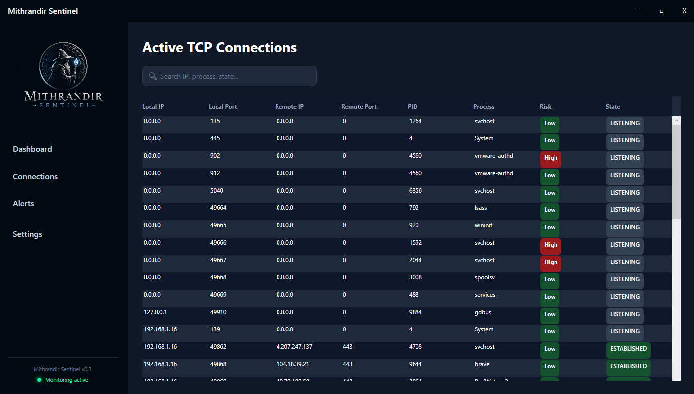
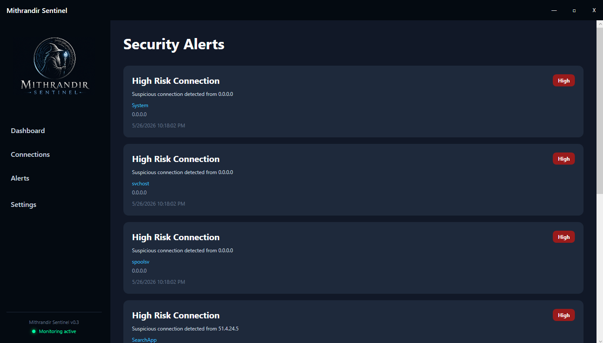
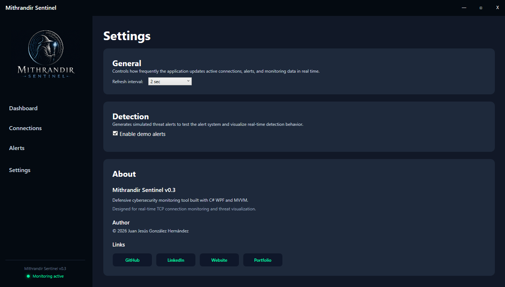

[](https://jjhernan-dev.github.io/projects/mithrandir-sentinel/)

## 🌍 Languages

- 🇺🇸 English
- 🇪🇸 Español

---

<details open>
<summary><strong>🇺🇸 English</strong></summary>

---

# Mithrandir Sentinel

Mithrandir Sentinel is a modern defensive cybersecurity monitoring tool built 
with WPF and C#, following the MVVM architectural pattern.

The application provides real-time TCP connection monitoring, threat 
visualization, dynamic alerting, and a SOC-inspired interface built to 
explore defensive security concepts and modern desktop engineering in depth.

## Features

- Real-time TCP connection monitoring with live DataGrid updates
- Dynamic cybersecurity dashboard with metric cards and telemetry panels
- Threat detection engine with high-risk connection flagging
- Real-time alert system with animated glow indicators
- Search, filtering, and configurable refresh intervals
- Persistent user settings
- Responsive SOC-inspired UI with custom window chrome and dark aesthetic
- MVVM architecture with shared live connection repository

## Tech Stack

| Layer        | Technology                  |
|--------------|-----------------------------|
| Language     | C# / .NET 10                |
| UI Framework | WPF                         |
| Architecture | MVVM                        |
| UI Libraries | MahApps.Metro               |
| Toolkit      | CommunityToolkit.Mvvm       |

## Getting Started

**Quick Download**

Download the latest Windows release of Mithrandir Sentinel:

➡️ [Download Mithrandir Sentinel v0.3.0](https://github.com/JJHernan-dev/Mithrandir-Sentinel/releases/tag/v0.3.0)

### Requirements

- Windows 10 / 11 (64-bit)
- No installation required
- Extract the `.zip` file
- Run `Mithrandir-Sentinel.exe`

**Build From Source (For developers)**
```bash
git clone https://github.com/youruser/mithrandir-sentinel.git
cd mithrandir-sentinel
dotnet run
```

## Architecture

The application follows MVVM to maintain clean separation of concerns 
across all layers.

```text
Views  →  ViewModels  →  Services  →  Models / Core
```

### Core Components

**NetworkService** — Retrieves active TCP connections directly from the OS.

**ThreatDetectionService** — Analyzes connections and generates simulated 
defensive security alerts.

**ConnectionRepository** — Maintains shared live connection data across views.

**WeakReferenceMessenger** — Handles lightweight ViewModel-to-ViewModel 
communication for real-time configuration updates.

## Project Structure

```text
Mithrandir_Sentinel/
├── Assets/
├── Core/
├── Models/
├── Services/
├── ViewModels/
├── Views/
├── Styles/
└── Messages/
```

## Screenshots

### Dashboard


### Connections



### Alerts



### Settings




## Disclaimer

This project is intended for educational and defensive security purposes only.

</details>

---

<details>
<summary><strong>🇪🇸 Español (Haz clic para abrir el desplegable)</strong></summary>

---

# Mithrandir Sentinel

Mithrandir Sentinel es una herramienta moderna de monitorización de ciberseguridad defensiva construida con WPF y C#, siguiendo el patrón arquitectónico MVVM.

La aplicación ofrece monitorización de conexiones TCP en tiempo real, visualización de amenazas, alertas dinámicas y una interfaz inspirada en SOC desarrollada para explorar en profundidad los conceptos de seguridad defensiva y la ingeniería moderna de aplicaciones de escritorio.

## Características

- Monitorización de conexiones TCP en tiempo real con actualizaciones en vivo del DataGrid
- Dashboard de ciberseguridad dinámico con tarjetas de métricas y paneles de telemetría
- Motor de detección de amenazas con marcado de conexiones de alto riesgo
- Sistema de alertas en tiempo real con indicadores de brillo animados
- Búsqueda, filtrado e intervalos de refresco configurables
- Configuración de usuario persistente
- Interfaz responsive inspirada en SOC con chrome de ventana personalizado y estética oscura
- Arquitectura MVVM con repositorio de conexiones en vivo compartido

## Tecnologías

| Capa          | Tecnología                  |
|---------------|-----------------------------|
| Lenguaje      | C# / .NET 10                |
| Framework UI  | WPF                         |
| Arquitectura  | MVVM                        |
| Librerías UI  | MahApps.Metro               |
| Toolkit       | CommunityToolkit.Mvvm       |

## Primeros Pasos

**Descarga Rápida**

Descarga la última versión para Windows de Mithrandir Sentinel:

➡️ [Descargar Mithrandir Sentinel v0.3.0](https://github.com/JJHernan-dev/Mithrandir-Sentinel/releases/tag/v0.3.0)

### Requisitos

- Windows 10 / 11 (64-bit)
- No requiere instalación
- Extrae el archivo `.zip`
- Ejecuta `Mithrandir-Sentinel.exe`

**Compilar desde el código fuente (para desarrolladores)**

```bash
git clone https://github.com/youruser/mithrandir-sentinel.git
cd mithrandir-sentinel
dotnet run
```

## Arquitectura

La aplicación sigue el patrón MVVM para mantener una separación de responsabilidades limpia en todas las capas.

```
Views  →  ViewModels  →  Services  →  Models / Core
```

### Componentes Principales

**NetworkService** — Obtiene las conexiones TCP activas directamente desde el sistema operativo.

**ThreatDetectionService** — Analiza las conexiones y genera alertas de seguridad defensiva simuladas.

**ConnectionRepository** — Mantiene los datos de conexiones en vivo compartidos entre las distintas vistas.

**WeakReferenceMessenger** — Gestiona la comunicación ligera entre ViewModels para actualizaciones de configuración en tiempo real.

## Estructura del Proyecto

```
Mithrandir_Sentinel/
├── Assets/
├── Core/
├── Models/
├── Services/
├── ViewModels/
├── Views/
├── Styles/
└── Messages/
```

## Capturas de Pantalla

### Dashboard


### Conexiones


### Alertas


### Configuración


## Aviso Legal

Este proyecto está destinado únicamente a fines educativos y de seguridad defensiva.


</details>
